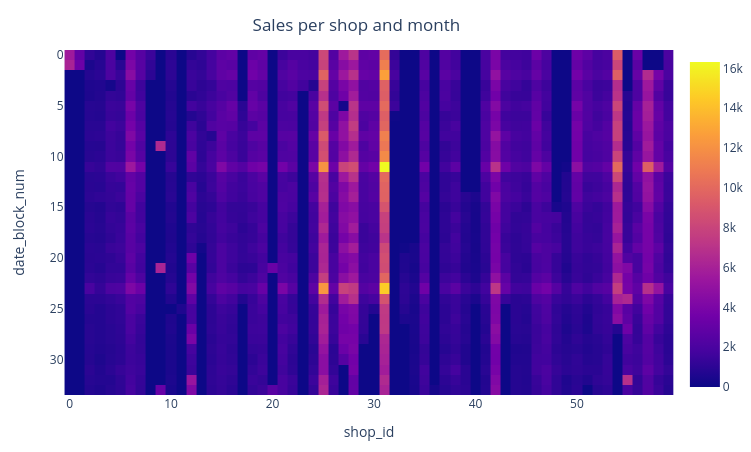

# About

This is the code for the [kaggle competition "Predict future sales"](https://www.kaggle.com/c/competitive-data-science-final-project). It also serves simultaneously as the final project of the [coursera course "How to win a data science competition"]().



### Problem description

Given the sales history from ~60 shops,  ~23000 items and 33 months plus some auxiliary information about the items and shops, predict the number of items sold per itemID and per shopID for the month 11/2015. 

### Result

The catboost regressor can predict the monthly sales with a root mean squared error (RMSE) of 0.929. This results corresponds to the  ~35% percentile of the kaggle leaderboard, where the best submission has an RMSE of 0.75 and the 10th best submission has an RMSE of 0.82 (as of 01.01.2021).

> Well done! Your solution gets the maximum grade! But, of course, the solution can be improved even further. Your public and private LB scores are: 0.929198 and 0.925085.


# FAQ

### How to install

Install all required python packages using conda:

```
conda env create --file requirements.yaml --name <your_name>
```

### How to run

- Run "train.py" to train the different regressors (Catboost regressor, NN and Linear) and perform prediction
- Run "train_ensemble.py" to train an ensemble classifier and perform prediction

### What I learned

- Decision tree libraries (catboost) and pandas, since this was my first "tabular" machine learning competition (in contrast to image based machine learning competitions)
- How to use jupyter notebooks better
- Plotly express
- The importance of a reliable validation strategy s. t. validation scores are similar to test scores. To me, this seemed like the hardest challenge in this competition and I am still not 100% satisfied with my outcome.
- How to setup a validation strategy for time series data
- How to use kNN as a regressor (only used kNN in unsupervised tasks before)
- How to ensemble models


# Report

### EDA

- See all results in EDA.ipynb. Some of the main insights were
  - ~10% of the items in test do not occur at all in train
  - Test contains all combinations of unique itemIDs and unique shopIDs
  - A lot of items are only sold for a few months

### Feature preprocessing and generation with respect to models

The following features were generated:
- date_block_num, year, month
- item_id, item_category, type, subtype
- shop_id, shop_city, shop_category
- for each [shop_id], [shop_id - item_id], [item_id]
  - monthly sales in last 1,2,3,4 month as well as relative difference in sales between months 1-2, 2-3, 1-3
  - cumulative monthly sales per cumulative month (i. e. mean number of item sold)
  - number of month with sales larger than zero
- mean price per item in last 1,2,3 months as well as relative difference in price between months 1-2, 2-3, 1-3

The categorical features were handled implicitly using the main catboost regressor. For the other regressors, all categorical features were target mean encoded. In order to regularize the mean encoding, the smoothing strategy was applied.

### Feature extraction from text

Since the text was in Russian, for the shop names and item category names, I depended a lot on the solution by https://www.kaggle.com/gordotron85/future-sales-xgboost-top-3. This solution splits the names into sensible categories. For example, the shop name is split into the city and the type of shop. Similarly, a type and subtype is extracted from the category.

For the item names, I extracted features in the following way:

- Words are stemmed using the SnowballStemmer library, which supports Russian language
- Afterwards, term frequency–inverse document frequency (TF-IDF) is employed 
- Last, the number of features are reduced using truncated SVD

### Validation

Up to the end I struggled with a significant discrepancy between my validation and test score. Train and validation split were defined as followed:

- Create train and validation set with all combinations of unique  itemID and unique shopID per date_block_num, the same way as the test set. 
- Train on date_block_num<33 and validate on date_block_num==33  (also tested with [33,32,31] with very similar results). When submitting, train on date_block_num<34.

Additionally, ...

- Features were calculated only from previous months (even things like mean price)
- Target values in train, as well as predicted values, were clipped to [0,20] 
- itemIDs which did not occur in test, were also discarded for  training and validation. This measure ensured that my test score was always better (!) than my validation score. In contrast, previously my validation score was always worse than my test score.

### Data leakages

According to https://www.kaggle.com/c/competitive-data-science-predict-future-sales/discussion/79142, the mean target value is 0.2839. This insight was used by scaling the final predictions s. t. they have the same mean target value. However, surprisingly, this scaling worsened the test result.

### Metrics optimization

Catboost offers to optimize the competition metric RMSE metric directly. The other regressors implicitly used metric MSE for optimization, which is suboptimal. However, I didn't rely on the other regressors too heavily.

### Advanced Features I: mean encodings

I didn't use mean encoding too heavily, since I didn't want to use any information from the future. Therefore, I only mean encoded the itemID, i. e. I calculated the mean sales per itemID over all months. 

This was regularized using an expanding mean over the months. For example, the mean for a specific item for month 10 was calculated by dividing the cumulative sales for this item up to month 9 (including) divided by the number of months.

### Advanced Features II

As mentioned above, I employed Truncated SVD to reduce the number of TF-IDF features.

### Hyperparameter tuning

I employed the hyperopt library to automatically select the best features for the catboost classifier. This feature selection was then also used for the other regressors.

### Ensembles

Apart from the main catboost regressor, I also trained a linear regressor (sklearn.linear_model.LinearRegression) and a neural net (sklearn.neural_network.MLPRegressor). They were used to predict sales for the month 30,31,32,33 and 34 in the following way:

```
for date_target in [30,31,32,33,34]:
	model.train(X[date<date_target])
	y_pred[date_target] = model.predict(X[date_target])
```


Afterwards, an ensemble model was trained. As input data, it used the predictions from the three individual models. In order to find the best model, a cross-validation was performed for the date blocks [30,31,32,33]. While ensemble models with  KNN, NN or catboost Regressor architectures yielded worse results than the main catboost model, the linear ensemble model improved the score by about 0.01. 

Finally, the ensemble model was trained on dates from [30,31,32,33] and used to predict sales for date block 34. However, despite the improvement in the cross-validation procedure, the ensemble model achieved a slightly worse test score than using only the catboost model. 


### Things that I would continue to work on now

- Make the validation score more representative of the test score by carefully testing different validation splits (e.g. number of new itemIDs, distribution of item categories, etc.)
- Optimize hyperparameters of all models
- Clean data more carefully (e.g. fix refunds, where price is negative, and outliers)
- Improve Linear and NN model using hyperparameter via a more careful mean encoding
- Validate the ensemble model by training on old and validating on new data instead of performing cross-validation